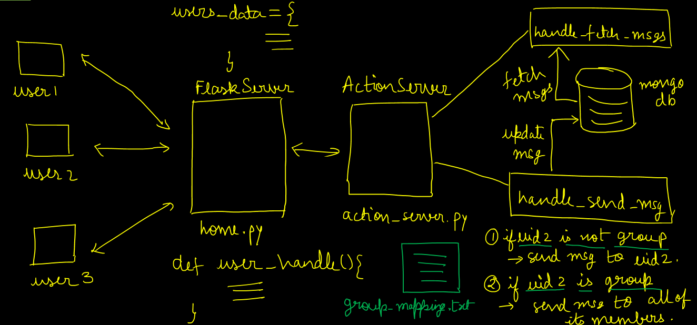
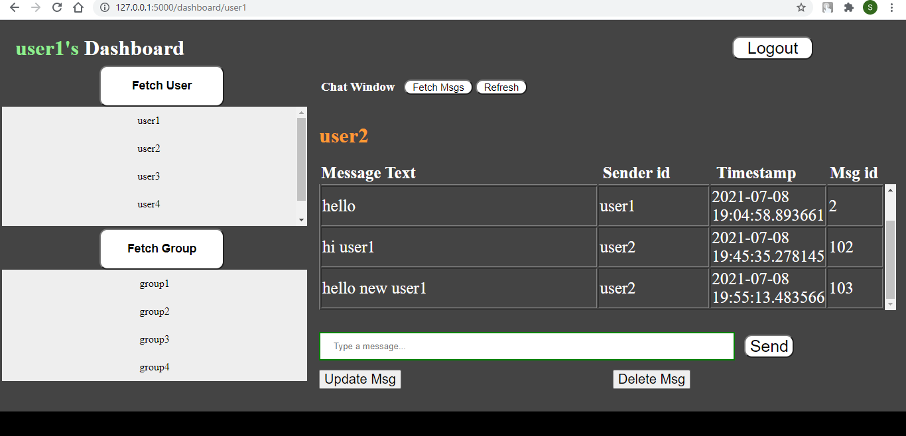

# Chat App using Flask
------------------------------------------------------------------------------
# Objective:
To make a web based Chat App using Flask with the following functionalities:
1. Register user
2. Login user 
3. Send Message
4. Deleting/Updating messages
5. Should support group chat
6. Chats should be persistent
------------------------------------------------------------------------------
# Technologies used:
1. Python
2. Flask
3. Kafka
4. MongoDB
------------------------------------------------------------------------------
# Overall Flow:

------------------------------------------------------------------------------
# Dashboard:

------------------------------------------------------------------------------
# How to run the code?

1. **Start Zookeeper :** First go to the directory where the kafka is present, then the run the following command:
```
.\bin\windows\zookeeper-server-start.bat config\zookeeper.properties
```

2. **Start Kafka Server:** Run the following command:
```
.\bin\windows\kafka-server-start.bat config\server.properties
```

3. **Start Flask Server:** First go to the Chat App directory, then the run the following command:
```
python home.py
```

4. **Start Action Server:** Run the following command:
```
python action_server.py
```
------------------------------------------------------------------------------
## Files:

### Html Pages(templates directory):
1. home.html
2. login.html
3. register.html
4. dashboard.html
5. invalid.html

### Python Files:
1. home.py
2. action_server.py


### Static Files(static directory):
1. styles.css

### Info Files:
1. msg_id.txt
2. users.txt
3. groups.txt
4. group_mapping.txt 

-------------------------------------------------------------------------------
# Structure for Storing the user information:
## User Record
```python
# User Info Table
{
    "user_id": "user1",
    "email": "user1@gmail.com", 
    "password": "123"
}
```

## Users Data

```python
# Users data details
{
    "user1" : {

            "cid" : "user2",
            "user_list" : ["user2", "user3"],
            "group_list" : ["group1"],
            "msg_list" : {
                            "user2":{
                                 "1":{
                                    "send_uid": "user2",
                                    "text": "Hi",
                                    "timestamp": "2021-07-08 19:04:30.307704"

                                },
                                  "2":{
                                    "send_uid": "user3",
                                    "text": "Hi, user1",
                                    "timestamp": "2021-07-08 19:04:30.307704"

                                }
                            }
                           
                         }

            },
    "user2" : {

            "cid" : "user2",
            "user_list" : ["user1", "user3"],
            "group_list" : ["group1"],
            "msg_list" : {
                              "user1":{
                                 "3":{
                                    "send_uid": "user2",
                                    "text": "Hi",
                                    "timestamp": "2021-07-08 19:04:30.307704"

                                    },
                                "2":{
                                    "send_uid": "user3",
                                    "text": "Hi, user1",
                                    "timestamp": "2021-07-08 19:04:30.307704"

                                    }
                                  }
                            
                         }

            }
}
```

## Chat Info:
1. If it is an one-to-one chat, then collection name will be  **uid1_and_uid2**.

2. If it is a group chat, then collection name will be **uid2**.

```
{
     { 
        "msg_id" : 101,
        "send_uid" : "user2", 
        "timestamp" : "2021-07-08 19:04:30.307704", 
        "text" : "hi user1" 
     },
     { 
        "msg_id" : 102,
        "send_uid" : "user1", 
        "timestamp" : "2021-07-08 19:04:30.307704", 
        "text" : "hi" 
     },
     { 
        "msg_id" : 103,
        "send_uid" : "user2", 
        "timestamp" : "2021-07-08 19:04:30.307704", 
        "text" : "hello" 
     } 
}
```

----------------------------------------------------------------------------
# Database Connection (MongoDB)

```python
myclient = pymongo.MongoClient("mongodb://localhost:27017/")
user_db = myclient["authentication"]
user_table = user_db["user_info"]
```

## Insert a record
`user_table.insert_one(reg_dict)`

## Query a record
`query = user_table.find({'uid':req['uid']})`

```python
myclient = pymongo.MongoClient("mongodb://localhost:27017/")
mydb = myclient["GlobalDB"]
```

## Update a record
```python
mycol = mydb[collection_name]
myquery = { "msg_id": msg_id }
mydoc = mycol.find(myquery)
newvalues = { "$set": { "text": text } }
mycol.update_one(myquery, newvalues)
```

## Delete a record
```python
mycol = mydb[collection_name]
myquery = { "msg_id": msg_id }
mydoc = mycol.find(myquery)
for x in mydoc:
    mycol.delete_one(x)
```

------------------------------------------------------------------------------
# Kafka 
## Producer Object in python:

```python
from kafka import KafkaProducer
producer = KafkaProducer(bootstrap_servers = 'localhost:9092')
producer.send(topic, json.dumps(dict_msg).encode('utf-8'))
```

## Consumer Object in python:
```python
from kafka import KafkaConsumer
consumer = KafkaConsumer(user_id,
         bootstrap_servers=['localhost:9092'],
         auto_offset_reset='latest',
         enable_auto_commit=True,
         value_deserializer=lambda x: loads(x.decode('utf-8')))
    
for msg in consumer:
    print(msg.value)
```
-------------------------------------------------------------------------------
# JavaScript:

```JavaScript
<script>
    chatWindow = document.getElementById('chat_window'); 
    var xH = chatWindow.scrollHeight; 
    chatWindow.scrollTo(0, xH);
</script>

onClick="window.location.reload();

<script>
    function openDiv() {
      document.getElementById("div").style.display = "block";
    }

    function closeDiv() {
      document.getElementById("div").style.display = "none";
    }
</script>

```
------------------------------------------------------------------------------
